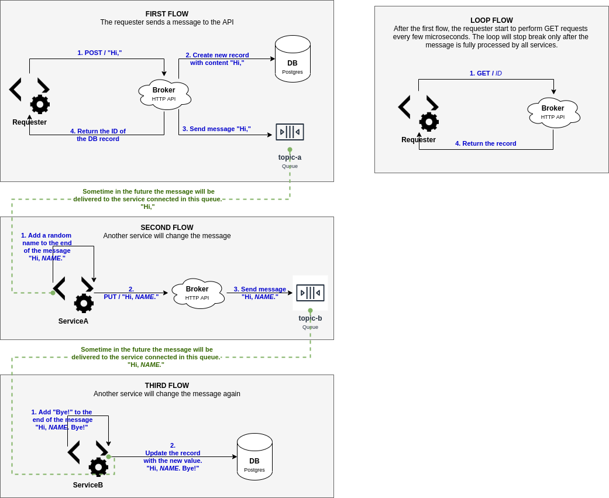

# async-microservice-communication

## About the project

This project shows an example of asynchronous communications between microservices.
- The application is controlled with configuration files (nothing is hard coded), which makes it easy to work with 
different environments (eg: stage, development, production, etc).
- Both modules [Borker] and [QueueSystem] are 100% covered with unit tests.
- Use [PHP PSR] standards.
- No frameworks were used (besides [PHPUnit]).
- Only four dependencies:
  - [php-di/php-di]: For dependency injection.
  - [guzzlehttp/psr7] and [guzzlehttp/guzzle]: As [PSR-7] implementation,.  
  - [laminas/laminas-config-aggregator]: To merge together all configurations from all the modules.



## Getting Started

1. Clone the project
1. Execute with [Docker Compose] (require Docker 18.06.0 or newer):
   ```bash
   $ docker-compose up -d
   ```
1. Execute the [Requester] service:
   ```bash
   $ docker-compose run php-requester
   ```


## Modular Application

This is a modular application, composed of three modules:
1. [Broker]: It's an HTTP API.
1. [QueueSystem]: Provides all the behaviors necessary for interacting with any queue system (Kafka, RabbitMQ, etc).
In the current version the project supports RabbitMQ. Others systems can be easily added by implementing the interface 
[\AMC\QueueSystem\Platform\PlatformInterface]. In a more complex project, this module could be a library installed via
Composer.
1. [ConsumerServices]: Contains all the others microservices beside the API. In a more complex project, each service 
should be in its own repository.


## Configuration Architecture

The application behavior can be controlled by external configuration files. These "external configuration files" reside 
in the folder [`config/autoload`]. So far we have only one file there, but any file that ends either with `.global.php`
or `.local.php` will be merged into one single set of configuration. 

In fact, that is how we change the configurations when running inside a Docker container. All the services in this 
project uses `localhost` to connect to an external process, like a database server for example. When you run the app 
with [Docker Compose], the app needs to change the address of the database server. This is done by copying the file 
[docker/docker.local.php] to the [`config/autoload`] folder. Take a look at the file [docker/docker.local.php] to 
understand better.

##### Configurations Available

Each module of the application provides its own configuration through a file called `ConfigProvider`. You can see these 
files on the [ConfigProvider of Broker Module], the [ConfigProvider of ConsumerServices Module] and the 
[ConfigProvider of QueueSystem Module].

Any configuration inside these `ConfigProvider` files can be overridden by creating the same config entry in a file 
inside the folder [`config/autoload`].

## Composer Scripts

There are three Composer scripts, as follows:
- **`serve`**: Start PHP built-in web server on the port 4000.
- **`test`**: Run all unit tests.
- **`test-coverage`**: Run all unit tests and generate a code coverage report in HTML format in the folder 
`test-coverage`. Please note that this functionality is only available when the tokenizer and Xdebug extensions are 
installed.

## Test Report


## To-do

List of what can still be improved.

- Refactor [index.php]. Maybe create a _Dispatcher_ to encapsulate the logic that decides which service to run.
- Add unit test for [ConsumerServices] module. 

[\AMC\QueueSystem\Platform\PlatformInterface]: https://github.com/stavarengo/async-microservice-communication/blob/master/src/QueueSystem/Platform/PlatformInterface.php
[`config/autoload`]: https://github.com/stavarengo/async-microservice-communication/tree/master/config/autoload
[Broker]: https://github.com/stavarengo/async-microservice-communication/tree/master/src/Broker
[ConfigProvider of Broker Module]: https://github.com/stavarengo/async-microservice-communication/blob/master/src/Broker/ConfigProvider.php
[ConfigProvider of ConsumerServices Module]: https://github.com/stavarengo/async-microservice-communication/blob/master/src/ConsumerServices/ConfigProvider.php
[ConfigProvider of QueueSystem Module]: https://github.com/stavarengo/async-microservice-communication/blob/master/src/QueueSystem/ConfigProvider.php
[ConsumerServices]: https://github.com/stavarengo/async-microservice-communication/tree/master/src/ConsumerServices
[Docker Compose]: https://docs.docker.com/compose/
[docker/docker.local.php]: https://github.com/stavarengo/async-microservice-communication/blob/master/docker/docker.local.php
[guzzlehttp/guzzle]: https://github.com/guzzle/guzzle
[guzzlehttp/psr7]: https://github.com/guzzle/psr7
[index.php]: https://github.com/stavarengo/async-microservice-communication/blob/master/public/index.php
[laminas/laminas-config-aggregator]: https://github.com/laminas/laminas-config-aggregator
[PHP PSR]: https://www.php-fig.org/
[php-di/php-di]: https://github.com/PHP-DI/PHP-DI
[PHPUnit]: https://phpunit.de/
[PSR-7]: https://www.php-fig.org/psr/psr-7/
[QueueSystem]: https://github.com/stavarengo/async-microservice-communication/tree/master/src/QueueSystem
[Requester]: https://github.com/stavarengo/async-microservice-communication/blob/master/src/ConsumerServices/Requester.php
